# bitwig-controller-tutorial
Tutorial for getting up and running with Bitwigs JAVA API in IntelliJ IDEA
Written around/for Bitwig Studio 2.2, on Windows 10.

# Creating a project, configuring IntelliJ IDEA

Begin with generating the Bitwig Remote Controller Script project. Do this by opening the Dashboard and going to Help > Documentation > Developer Resources > Controller Scripting Guide > New Project...
This will open the following dialog box:

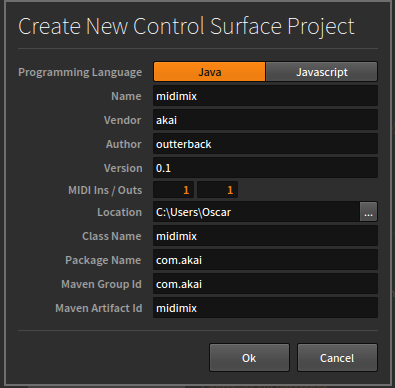

Select a suitable location, configure the Name, Vendor, Author, and MIDI Ins / Outs. Click OK to generate the default boilerplate project. This will create a directory in the specified Location, with the name specified in Name. I will end up with the directory C:\Users\Oscar\midimix.

In IntelliJ, navigate to the directory you have generated and open it as a project. This can be done by opening the pom.xml file.

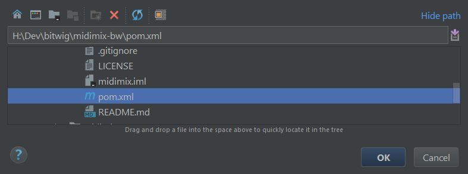

In the top right of the IntelliJ window, click the dropdown menu and select Edit Configurations...

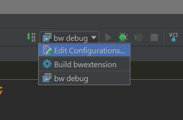

This will open the following dialog box. Click the green plus sign in the top left, select a new Maven configuration. Give it a name, and type "install" in the Command Line box.

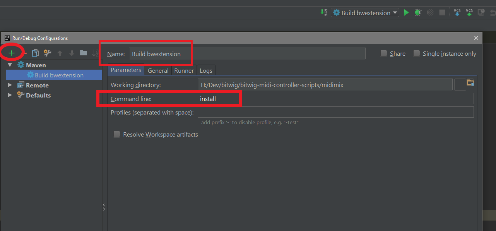

This step is optional, but incredibly convenient. You can set up your build configuration to build your .bwextension into the Extensions directory. 

**NOTE**: This means building your script will automatically overwrite the .bwextension file in your Extensions directory. Take care to name your destinationFile in such a way that you do not lose something of value to you. 

Navigate to the pom.xml file in the root directory of the project. Change the <destinationFile> value to include the path of your Bitwig Extensions directory. Make sure to escape backslashes, at least on Windows. Bottom part of the image shows the default setting, top part shows how I've configured mine to build in the Extensions directory. **Do not remove the filename**.

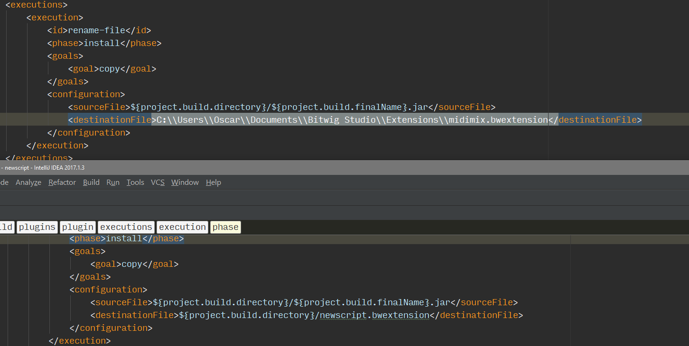

In order to build the extension, select the correct Build Configuration and click the green arrow next to it. If the build succeeds you will see the message "BUILD SUCCESS" at the bottom.

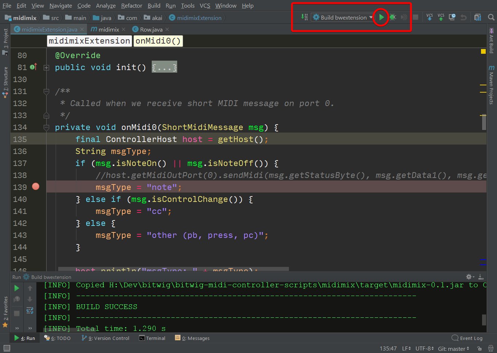

In Bitwig Studio, I have connected my script to my MIDI Mix controller. I only do this **once**. Since I have configured Maven to build into the extensions directory, every time I build the project in IntelliJ it will automatically reload in Bitwig.

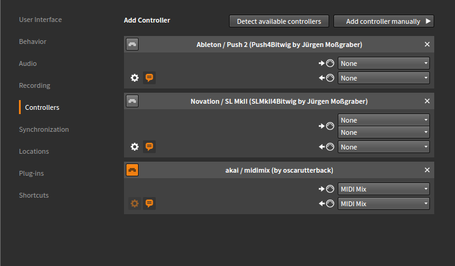
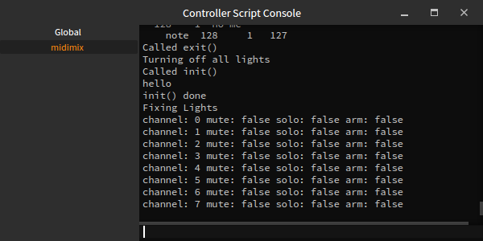

# Setting up remote debugging

First, add an environment variable named BITWIG_DEBUG_PORT to your operating system. Details here: https://www.java.com/en/download/help/path.xml

Choose a port number that is not in use. Note: If you are using a VPN, it may block communication between IDEA and Bitwig. You may have to disable it.

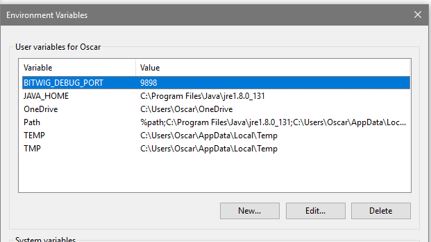

Next, go back to Edit Configurations as before. Click the green plus and select a new Remote configuration. Give it a name, and in the Port box, enter the same port you added as an environment variable.

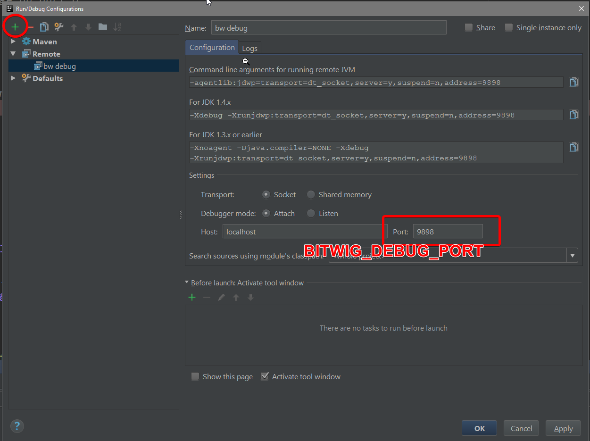

Now, once you have built your script and have it enabled in Bitwig Studio as described above, select your Debug configuration in IDEA. Click the bug symbol to enable the debugger.
 
 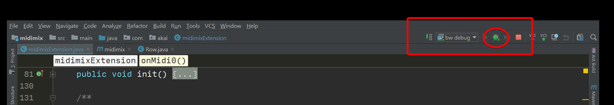

IDEA will now connect to Bitwig Studio and react to breakpoints. You will see the following message in the Debug window at the bottom.

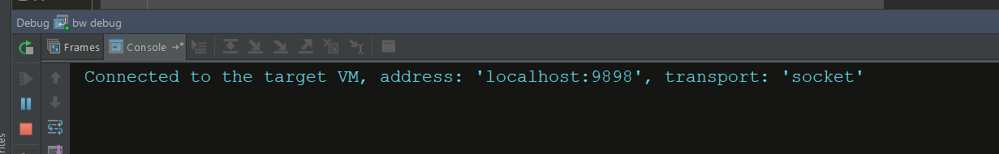

In the image below, I have activated a single breakpoint that triggered when I pressed one of the buttons on the MIDI Mix controller.

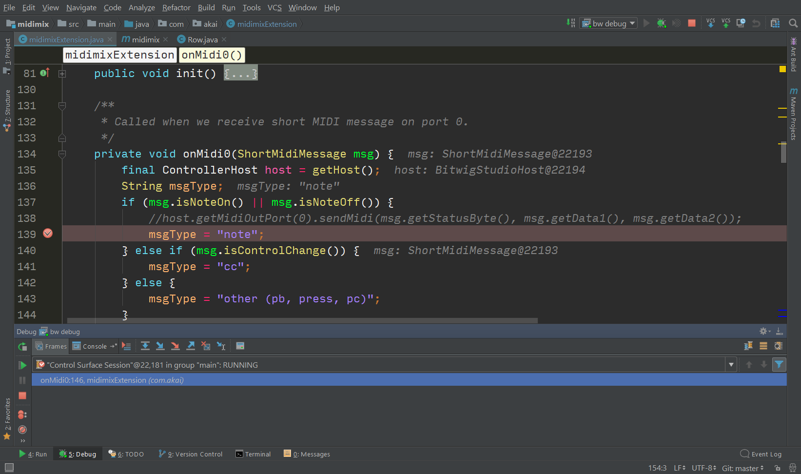

**Bitwig Studio will freeze completely when encountering a breakpoint, this is entirely normal**. The program was halted because of the debugger, and it is waiting for your input. You can now debug your script as if it were a regular Java program. You can disable your breakpoints, resume execution or stop the debugger and so on. I will not go into details about how the debugger works. 

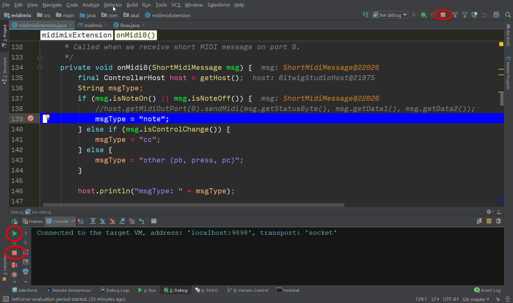